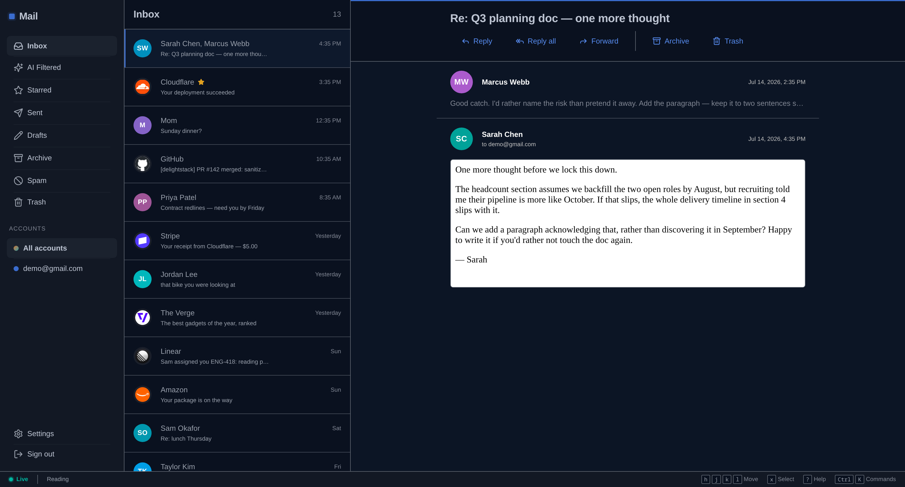

# DelightMail

A keyboard-first, ad-free email client you host yourself. It puts one calm,
extremely fast inbox in front of your Gmail accounts and your own custom-domain
addresses — and runs entirely on your own Cloudflare account.



## Why this exists

Gmail's web client keeps getting louder: ads in the inbox, storage upsells,
upgrade prompts, and still no way to see several accounts in one place. Paying
for Google Workspace just to receive mail at your own domain is its own tax.

DelightMail replaces the *interface*, not the *infrastructure*. Your Gmail keeps
working exactly as it does today — DelightMail mirrors it, renders it fast, and
sends through it. Custom-domain mail arrives through Cloudflare Email Routing, so
a vanity address costs you nothing extra.

It is a single-user app by default. You run it, you own the data, nobody else is
in the loop.

## What you get

- **Fast by construction.** Every navigation renders from a local IndexedDB +
  full-text mirror in under 100ms. The network is consulted *after* paint, never
  in front of it.
- **Keyboard-first, yazi-inspired.** `j`/`k` move, single letters act (`a`
  archive, `d` trash, `r` reply), `g`-chords jump between folders, `Ctrl+K` opens
  the command palette, `?` lists every binding. The mouse is optional.
- **One inbox, many accounts.** Several Gmail accounts plus any number of
  custom-domain addresses, unified — or filtered down to one account instantly.
- **Calm by default.** An optional AI triage layer moves marketing noise out
  before you see it, into a reviewable quarantine with a full audit trail. It
  can only ever *suggest and file* — the model returns JSON, never gets tools,
  and can't send or permanently delete anything.
- **One-click unsubscribe.** RFC 8058 one-click where the sender supports it,
  with the list of what you're still subscribed to in one place.
- **Daily-driver muscle.** Snooze (`b`), undo send, full-text body search with
  `from:` / `has:attachment` / `is:unread` operators, attachments and inline
  images in the reader, and one-key "never filter this sender" rescue rules
  for anything the AI quarantines.
- **You own the archive.** Every message is mirrored to your own R2 bucket and
  SQLite. If a Gmail account vanishes tomorrow, your mail doesn't.
- **An app, not a tab.** Installable PWA: offline reading, web-push notifications,
  swipe actions, and a mobile layout built for thumbs.

## How it works

Two Cloudflare Workers:

- **App worker** (`src/`) — the SvelteKit UI plus the `/api/*` routes.
- **Server worker** (`server/`) — hosts every Durable Object (a `MailboxServer`
  per user, a `SyncEngine` per connected account, auth, websockets, rate
  limiting), the inbound Cloudflare `email()` handler, and the Gmail webhook.

Each connected account gets its own Durable Object, so sync for one account can
never stall another, and each user's mail lives in a separate SQLite file. The
app binds the Durable Objects cross-script, which is why the server worker
deploys first.

The risky parts — MIME parsing, threading, HTML sanitizing, unsubscribe
extraction, identity resolution, triage rules — are pure functions in
`src/lib/mail/*` with no I/O, exhaustively unit-tested and shared by both
workers.

## Self-hosting

Everything runs in your Cloudflare account. A personal instance costs about **$5/mo**
(the Workers Paid plan) plus pennies of R2 and AI usage. No telemetry, ever.

See **[docs/SELF_HOSTING.md](docs/SELF_HOSTING.md)** for the full walkthrough. The
short version:

```sh
git clone https://github.com/brianschwabauer/delightmail
cd delightmail && pnpm install

wrangler r2 bucket create delightmail
wrangler kv namespace create CACHE     # put the id in both wrangler configs

# set your hostname in wrangler.jsonc (route + PUBLIC_APP_URL)
pnpm run secrets secrets.env           # JWT / encryption key / OWNER_EMAIL / …

wrangler deploy --config server/wrangler.jsonc   # the server worker, FIRST
pnpm build && wrangler deploy                    # then the app
```

Gmail, custom domains, AI triage, and web push are each optional and independently
configurable — see `docs/providers/`. Cloudflare is the only hard dependency.

## Develop

```sh
pnpm install
cp .dev.vars.example .dev.vars                 # set OWNER_EMAIL + CLOUDFLARE_ACCOUNT_ID
cp server/.dev.vars.example server/.dev.vars   # the defaults work for local dev

pnpm dev          # server worker (:8710) + the app with HMR on http://localhost:5710
pnpm dev:seed     # (another terminal) sign in headlessly + fill the mailbox with sample mail
```

`pnpm dev` starts the Durable Object host and the SvelteKit dev server together
(Vite HMR; the app reaches the DOs over an HTTP RPC bridge). Nothing touches real
mail: no provider is connected unless you add Gmail/IMAP credentials, and with
`DEV=true` outbound messages are recorded as sent and logged instead of
delivered. On the sign-in page, "Sign in instantly as the owner" skips the
magic-link round trip.

`pnpm dev:full` instead serves the production build of both workers in ONE
`wrangler dev` session — the exact deploy topology (native DO RPC, real
WebSockets, no bridge), rebuilding the app on every `src/` change (~3s, no HMR).
Reach for it when debugging sync/send/DO behaviour or a 500 you don't trust.

```sh
pnpm check   # svelte-check (app) + tsc (server)
pnpm test    # vitest — the pure mail domain layer
pnpm build   # production build of both workers
```

## Security posture

- Mail credentials (OAuth refresh tokens, IMAP passwords) are AES-GCM encrypted
  under `CREDENTIALS_ENCRYPTION_KEY` before they touch storage, and decrypted only
  inside the SyncEngine at the moment of use.
- Email HTML is sanitized at ingest **and** rendered inside a sandboxed,
  CSP-pinned iframe, so a script can't execute in the app's origin even if
  sanitization misses something.
- Remote images are blocked by default.
- The Gmail webhook is OIDC-verified and fails closed; the inbound `email()`
  handler is platform-authenticated. Both are idempotent, so replay is harmless.
- The AI model only ever returns JSON. It has no tools, and cannot send mail or
  permanently delete anything.
- Isolation is structural: each user's mail lives in its own Durable Object, and
  R2 keys are org-prefixed and never public.

Sign-ups are closed by default — only `OWNER_EMAIL` can create an account unless
you explicitly set `SIGNUPS_ENABLED`.

## Environment variables

| Variable | Required | Purpose |
| --- | --- | --- |
| `PUBLIC_APP_URL` | ✓ | Canonical origin, e.g. `https://mail.example.com` |
| `JWT_KEY_SECRET` | ✓ | Auth signing secret — 64-char hex (`openssl rand -hex 32`), **identical on both workers** |
| `CREDENTIALS_ENCRYPTION_KEY` | ✓ | AES-GCM key for stored mail credentials — 64-char hex |
| `OWNER_EMAIL` | ✓ | The only address allowed to sign up (`SIGNUPS_ENABLED` opens it up) |
| `MAIL_FROM` | ✓ | Sender for magic links (via the Email binding or an SMTP relay) |
| `GOOGLE_CLIENT_ID` / `GOOGLE_CLIENT_SECRET` | – | Gmail OAuth (omit → Gmail connect is hidden) |
| `GMAIL_PUBSUB_TOPIC` / `GMAIL_PUSH_AUDIENCE` / `GMAIL_PUSH_SA_EMAIL` | – | Gmail push (omit → poll every `GMAIL_POLL_SECONDS`, default 90) |
| `AI_GATEWAY_NAME` / `AI_TRIAGE_ROUTE` | – | AI triage via a Cloudflare AI Gateway dynamic route |
| `VAPID_PUBLIC_KEY` / `VAPID_PRIVATE_KEY` / `VAPID_SUBJECT` | – | Web push |
| `SMTP_RELAY_HOST` / `_PORT` / `_USER` / `_PASS` | – | Sending without Cloudflare Email Service |
| `SEND_DAILY_LIMIT` / `IMAGE_PROXY` / `GMAIL_FULL_SCOPE` | – | Tunables (defaults: 100 / off / off) |

The startup env check logs exactly what's missing or malformed, so read the worker
logs first if sign-in doesn't work.

## Project status

DelightMail is built and in daily use by its author, but it is **a personal
project published as-is**, not a product. Gmail sync, custom-domain send/receive,
AI triage, PWA, and mobile are all implemented. Generic IMAP/SMTP is written but
gated on a Cloudflare sockets compatibility spike — the connection test in
Settings → Accounts tells you whether it works on your deployment.

Expect rough edges, and expect to be comfortable with `wrangler` if you self-host.

## Contributing

I'm not accepting pull requests, and issues are closed — this is published for
people to read, run, and fork, not as a project I'm maintaining for others. Fork
it and make it yours; that's what the license is for.

## License

MIT — see [LICENSE](LICENSE). Built on
[delightstack](https://github.com/brianschwabauer/delightstack).
